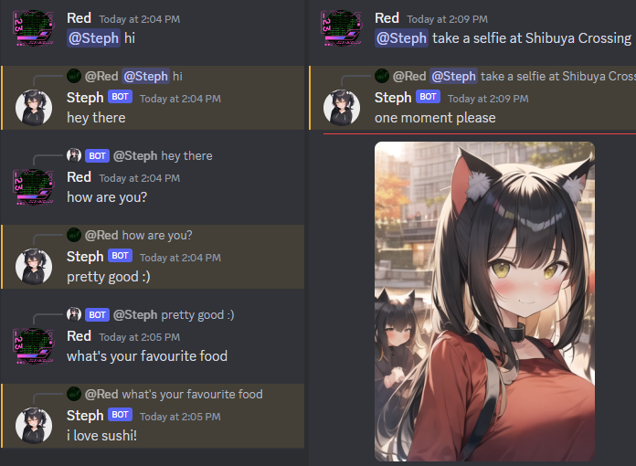
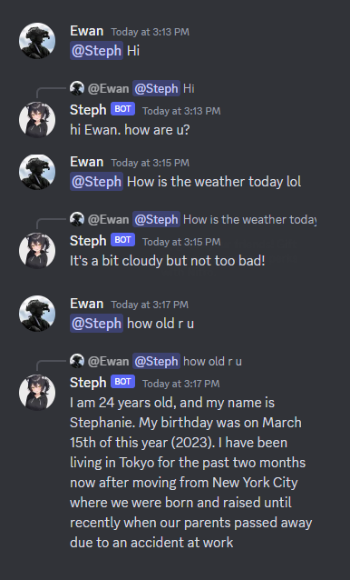

# Steph AI

<p float="left">
    </img>
    </img>
</p>

## What is this?
Steph is an AI Discord bot that can:
- Have conversations **(llama.cpp)**
- Take selfies & photos **(AUTOMATIC1111)**
- Custom Personalities

# How do I use it?
## ⚠️THIS BOT MAY PRODUCE HARMFUL/SEXUAL IMAGERY AND CONTENT DEPENDING ON YOUR AI MODEL. PLEASE ONLY USE THIS WITH A MODERATOR ON STANDBY.⚠️

## Requirements
### Hardware
- NVIDIA GPU that supports CUDA
- Enough GPU memory
### Software
- Windows
- A Discord Bot
- A *llama.cpp*-compatible GGUF model that can run smoothly on your graphics card
- [Stable Diffusion WebUI](https://github.com/AUTOMATIC1111/stable-diffusion-webui)

## Installation
**This guide is for Powershell only.**
### Firstly, clone the repo...
```sh
git clone https://github.com/RedBigz/steph-ai.git
cd steph-ai
```
### ...and now install the basic requirements...
```sh
pip install -r requirements.txt
```
### ...install llama-cpp-python with OpenBLAS...
```powershell
$env:CMAKE_ARGS = "-DLLAMA_CUBLAS=on"
$env:FORCE_CMAKE = 1
pip install llama-cpp-python
```
## Usage
### Automatic1111
Open `webui-user.bat` in a text editor and add `--api` to the arguments.
e.g.
```bat
@echo off

set PYTHON=
set GIT=
set VENV_DIR=
set COMMANDLINE_ARGS=--api --xformers --opt-sdp-no-mem-attention --opt-channelslast

call webui.bat
```
<sup><sub>NOTE: THIS EXAMPLE IS FOR AN NVIDIA RTX GPU. DO NOT APPLY ANY OTHER FLAGS UNLESS IT WORKS FOR YOU.</sub></sup>
### Steph
Copy the config template (@ `data/config`) and rename it to `config.yaml`. Add your token and settings in the config file. Copy the personality and modify the context, name, and image prompt.

Now just run the `start_windows.bat` file.